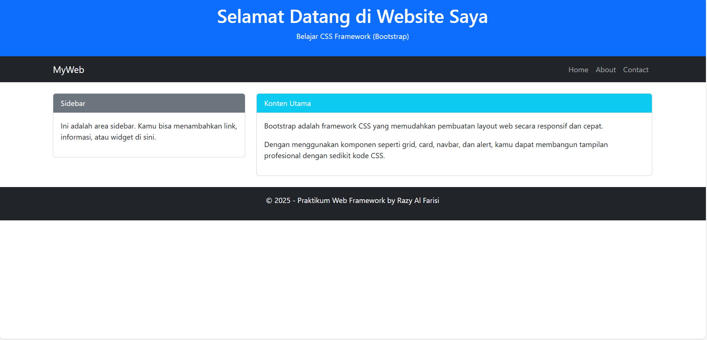
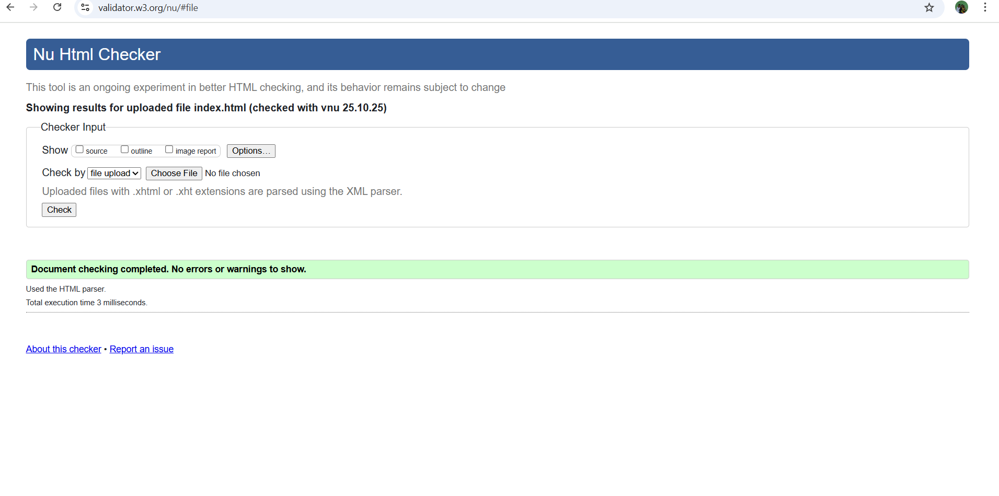

## 🔧 **lab6web**

### Identitas

* **Nama:** Razy Al Farisi
* **NIM:** 312410524
* **Kelas:** TI.24.A5

---

### 1. Membuat Struktur Dasar HTML
Membuat file `index.html` dan menambahkan link CDN Bootstrap.

```html
<link href="https://cdn.jsdelivr.net/npm/bootstrap@5.3.3/dist/css/bootstrap.min.css" rel="stylesheet">
````

### 2. Membuat Layout Web

Menggunakan struktur `header`, `navbar`, `main (sidebar + content)`, dan `footer` dengan sistem grid dari Bootstrap.

  

### 3. Validasi HTML

Melakukan validasi melalui situs [validator.w3.org](http://validator.w3.org) untuk memastikan kode valid HTML5.

  

---

## Hasil Akhir

Website tampil responsif dengan layout:

* Header dengan judul dan deskripsi.
* Navbar navigasi.
* Sidebar di sisi kiri.
* Konten utama di kanan.
* Footer di bagian bawah.
